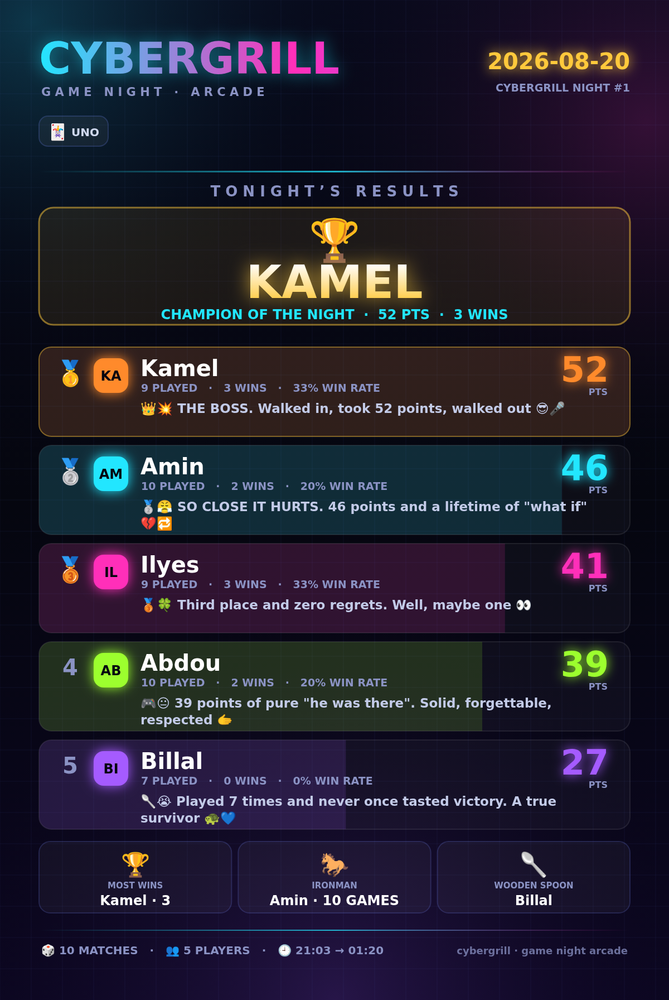

# cybergrill — game night scoreboard

A scoreboard for the nights we actually play: UNO, Dominos, FC 25, eFootball and
TopSpin 2K. One dashboard runs the whole evening, every night gets archived as a
dated file, and GitHub Actions rebuilds the season table and the shareable recap
card on its own. No server, no cost.

```
index.html          the dashboard — arcade, cup, UNO room, history
data/nights/        one JSON per friends night, the permanent record
data/nights-family/ same, for the family board (admin only)
publish.yml   on push  rebuild season + render cards + deploy Pages
check.yml     on PR    validate every night file before it lands
```

<!-- STANDINGS:BEGIN -->

**1 night · 10 matches** · last played **2026-08-20**, won by **Kamel**

| # | Player | Points | Nights | Matches | Wins | Night titles |
|---|---|---:|---:|---:|---:|---:|
| 🥇 | **Kamel** | 52 | 1 | 9 | 3 | 1 |
| 🥈 | **Amin** | 46 | 1 | 10 | 2 | — |
| 🥉 | **Ilyes** | 41 | 1 | 9 | 3 | — |
| 4 | **Abdou** | 39 | 1 | 10 | 2 | — |
| 5 | **Billal** | 27 | 1 | 7 | 0 | — |



<!-- STANDINGS:END -->

---

## The dashboard

Open `site/index.html` — one file, no build step, works offline, keeps its state
in the browser so a refresh mid-party costs you nothing.

**Three modes across the top.**

**🎮 Arcade** — the fast lane. Click players in finishing order, hit record. 10
points for the win, then 6 / 3 / 1. Global leaderboard on the left, per-game
standings and a live feed on the right. Add players mid-night, they slot straight
in.

**🏆 Cup** — a real tournament for the football games, with an animated draw.
Four formats:

| Format | How it runs |
|---|---|
| **League phase + knockout** | The new Champions League shape. One table, everyone plays everyone, then the table splits: top seeds go straight through, mid-table plays a one-match play-off, the bottom goes home. |
| **Groups + knockout** | Classic. Groups of 3–5, top two qualify, semis and a final. |
| **Straight knockout** | Single elimination, byes seeded to the top of the bracket. |
| **Simple league** | Table only, top of the table wins. |

Every fixture can be played on **FC 25 or eFootball** — pick per match, so nobody
has to play the game they hate. Knockout ties level after full time go to
penalties. Group tables run on real football scoring (win 3, draw 1) with goal
difference, and every cup result also feeds the global arcade leaderboard.

**🃏 UNO Room** — the rules, the maths and the ceremony:

- **Three scoring modes**, switchable mid-night: placement points (fast),
  official Mattel card-counting to 500, or both at once — count the cards and the
  finishing order is derived from who had the fewest points left.
- **The draw.** Everyone draws a card, highest deals, ties redraw automatically.
  It then tells you who plays first (dealer's left) and which way play runs, on an
  animated table.
- **The round calculator.** Tap the cards left in each hand — numbers at face
  value, Skip / Reverse / Draw Two at 20, Wilds at 50 — and it banks the total to
  the winner and tracks the race to 500.
- **The full rulebook**, including the Wild Draw Four challenge, the UNO call
  penalty, what the first flipped card does, and two-player rules. Plus six
  **house rules** (stacking, jump-in, 7-0, draw-until-you-can-play…) all clearly
  marked as *not official*, so the argument happens before the deal instead of
  after it.

**🌍 Three languages, one tap.** The chip in the top bar cycles
**English → Français → العربية**. Arabic switches the whole page to
right-to-left, and the UNO rulebook, the cup format explanations and the recap
card are all fully translated — not just the buttons.

**📱 Built for a phone too.** Below 900px the three columns stack, the mode
switcher and tool chips become their own rows, the keyboard hints disappear and
every control is a proper thumb-sized tap target. Inputs use 16px text so iOS
does not zoom when you focus them. Pass the phone around the table.

**📅 History** — every night you have published, by date: the all-time table
across all of them, and each night expandable into its full standings with its
recap card. Reads `bundle.json` from the published site, so it works for anyone
who opens the URL — no local data needed.

**🔒 Admin lock** — set a passcode and the site opens **read-only** for
everyone. Board, history, rules and brackets all visible; recording results,
adding players, resetting and publishing all need the passcode. Unlock once per
browser and it sticks.

```bash
npm run passcode -- yourpasscode
```

Paste the two lines it prints into `config.yml`, rebuild, push. Leave them blank
and everyone can edit, which is what you want while it is only on your laptop.

⚠️ Worth being clear about what this is. The hash ships inside a public page, so
somebody determined could brute-force a weak passcode offline. It stops your
friends editing the board mid-party. It is not a security boundary — do not
reuse a password you care about.

**👨‍👩‍👦 The family board** — a second, completely separate scoreboard that only
appears when you are unlocked as admin. Its own players, its own leaderboard, its
own cup, its own UNO session, its own history. Nothing is shared with the friends
board and nothing mixes.

Click the **🎮 FRIENDS / 👨‍👩‍👦 FAMILY** chip in the top bar (or press **F**) to
switch. The whole interface turns warm orange so you always know which board you
are on. Locking the dashboard drops you back to friends and hides the chip
entirely — a visitor never sees that the family board exists.

Family nights publish to `data/nights-family/` and build into
`site/bundle-family.json` and `site/cards-family/`. The public season page and
the README table below are built from the **friends board only**.

⚠️ Hidden in the interface is not the same as private. This repo is public, so
family night files are readable by anyone who browses
`data/nights-family/` on GitHub directly. The chip keeps the board out of the way
and out of a visitor's hands — it does not encrypt anything. If the scores
genuinely need to be private, make the repo private (you lose the free Pages URL)
or keep family nights local and never publish them.

**👥 Regulars** — the roster remembers everyone who has ever played, survives a
reset, and offers them back as one-tap chips on the intro and next to the add
box. It also learns names from the published history, so a fresh browser still
knows your crew.

Press **S** at any point to save the night.

---

## The UNO table

`/game/` is a real, playable UNO — the official rules plus every house rule as
a switch, refereed by `game/engine.js`, which has 109 tests behind it.

**Five ways to play**

| | |
|---|---|
| 🎴 **Classic** | Rounds until somebody reaches 200 / 300 / 500. |
| 🏆 **Winner stays on** | Last place gives up the seat to whoever is waiting. If the seat that goes is yours, you hand the device over and play on as the person sitting down. |
| ⚡ **Blitz** | A turn clock — 20, 12, 7 or 5 seconds. Run out and you draw and pass; you never lose a card to the clock. |
| 🤝 **Teams 2v2** | Alternate seats, one score per team. The round winner's team banks everything the other team is holding. |
| 💀 **Elimination** | Nobody scores. Whoever is left holding the most goes out, and stays at the table as a ghost until one player is standing. |

**Three decks.** 🂠 Classic is the real thing — white border, tilted oval,
proper symbols for skip, reverse and draw two, quartered wilds. ✨ Neon deck is
the same deck lit for the arcade. 🌈 Neon arcade drops the oval for glowing
glass slabs. Every face is drawn as SVG, so it stays sharp at any size. Pick one
on the setup screen; the 🂠 DECK chip switches it mid-game and remembers.

**📊 INFO** opens a panel that tells you what you are allowed to know: the
colour breakdown of your hand, what it is worth if you lose the round, how many
of your cards are actually playable, what every opponent is holding and how far
they are from the target, who has been drawing, who is one card away and
catchable, and how much of the deck is left. Hold a card (or hover it) and it
explains itself — including the awkward bits, like why a +4 can be challenged.
**💡 HINT** names one reasonable move and says why.

**Solo** deals you a table of bots and needs nothing but the page — it works
offline, and from a file:// double-click.

**Online** puts you in a room with a four-letter code your friends type in.
Turn it on by deploying the Worker in `server/` once and pasting its URL into
`config.yml` as `uno_server` — see [server/README.md](server/README.md). It is
free to run.

🎵 is a four-bar loop built from oscillators, not a file — it sits almost out
of hearing until somebody drops to one card, then a second layer creeps in on
top. Off by default.

The room is authoritative: it holds the only complete game and sends each
player a redacted view, so a hand cannot be read out of somebody else's
network tab. Every move is re-validated against the same engine the solo game
uses. Drop out and your seat waits 25 seconds before the room starts playing
for you; come back and `hello` hands your own cards straight back.

---

## Saving a night

`S` on the dashboard, or the **💾 SAVE NIGHT** button. Three ways out of that
dialog:

**⬆️ Publish to GitHub** — writes `data/nights/<date>.json` straight into the
repo and the Action takes over. Nothing to download, nothing to commit. Works
from a phone. Needs a token once (below).

**💾 Download night JSON** then, on the machine with the repo:

```bash
npm run night
```

It finds the newest `YYYY-MM-DD.json` in your Downloads, files it into
`data/nights/`, validates it, commits and pushes.

**🖼️ Download PNG** — the recap card, with a line about every player.

The PNG the button gives you and the PNG the Action commits are drawn by the same
code (`shared/card.js`), so they are identical.

Push the JSON and the `publish` workflow does the rest: revalidates the file,
rebuilds `site/bundle.json` and the season page, re-renders the card, rewrites the
standings table in this README, and redeploys Pages.

### The token, for the publish button

Make a **fine-grained** token at
[github.com/settings/personal-access-tokens/new](https://github.com/settings/personal-access-tokens/new):

- **Repository access** → Only select repositories → your cybergrill repo
- **Permissions** → Repository permissions → **Contents: Read and write**
- Nothing else. Give it a short expiry.

Paste it into the publish box once. It is kept in that browser's localStorage
and sent only to `api.github.com`. Tick off "remember" on a shared machine.

That token can write to this one repo, so treat it like a key to it — if a
phone with it goes missing, revoke the token on GitHub and it is dead.

### The night file

```json
{
  "date": "2026-08-20",
  "title": "CyberGrill Night #1",
  "games": ["uno"],
  "players": [{ "id": "amin", "name": "Amin", "color": "#22e6ff" }],
  "matches": [
    { "n": 1, "time": "21:03", "game": "uno", "ranking": ["amin", "ilyes", "abdou"] }
  ],
  "verifiedStandings": [{ "id": "amin", "pts": 46, "played": 10, "wins": 2 }]
}
```

`ranking` is finishing order, first to last. `verifiedStandings` is optional and
is the point of the whole thing: the build **recomputes** the table from the
matches and fails the run if the two disagree. A night file cannot silently drift
away from what actually happened.

---

## Updating

One command. It repairs a broken `.git`, finds a nested folder if you extracted
into one, discards any local mess, pulls what the Action committed, copies the
update in, validates, commits, pushes and kicks off the rebuild:

```powershell
.\update.ps1 -From C:\Users\oaak2\Downloads\<extracted-update-folder>
```

It never merges, so there is never a conflict to resolve by hand.

## Setup — one command

From inside this folder:

```powershell
powershell -ExecutionPolicy Bypass -File .\setup.ps1     # Windows
```
```bash
bash setup.sh                                            # macOS / Linux
```

You need `git` and the GitHub CLI (`winget install --id GitHub.cli`, or
`brew install gh`). The script signs you in to GitHub in a browser, creates the
repo, pushes, enables Pages and the Actions write permission, and kicks off the
first build. Nothing here is secret — there are no tokens and no secrets to set.

## Setup by hand

**1. Create the repo.** Public is easiest: unlimited Actions minutes and free
Pages.

```bash
git init && git add . && git commit -m "cybergrill"
git branch -M main
git remote add origin https://github.com/<you>/cybergrill.git
git push -u origin main
```

**2. Turn on Pages.** Settings → Pages → Source: **GitHub Actions**. After the
first run the dashboard is at `https://<you>.github.io/cybergrill/` and the season
archive at `.../season.html`. Put that URL into `site_url` in `config.yml`.

**3. Allow Actions to push.** Settings → Actions → General → Workflow permissions
→ **Read and write permissions**. The publish job commits `site/` and this README.

**4. Run it.** Actions → **publish** → Run workflow. Or just push a night file.

---

## Local

```bash
npm install                 # only needed for rendering cards
npm run check               # validate data/nights/ and stop
npm run build               # season table, bundle.json, site/, README
npm run cards               # re-render every night PNG
npm run all                 # both
npm run night               # file tonight's export and push it
npm run passcode -- secret  # generate the admin passcode pair
```

`npm run build` works with no dependencies at all. Only `npm run cards` needs
Playwright, because it drives a headless Chromium to draw the canvas.

---

## Layout

```
index.html            dashboard source (shared/*.js is inlined at build time)
shared/card.js        the recap card renderer — browser and Node use this same file
shared/i18n.js        EN / FR / AR labels + the patterns for dynamic strings
shared/i18n-prose.js  the UNO rulebook and the long explanations, per language
config.yml            title, points, draw value, UNO target
data/nights/*.json    one file per friends night, the permanent record
data/nights-family/   same for the family board — its own bundle and cards
scripts/build.mjs     validate → season table → bundle.json → site → README
scripts/render-card.mjs   headless Chromium → site/cards/*.png
scripts/night.mjs     file tonight's export, validate, commit, push
scripts/passcode.mjs  generate the admin_salt / admin_hash pair
game/engine.js        the UNO rules — one file, no DOM, used by table and server
game/engine.test.mjs  109 tests, run with `npm test`
game/index.html       the playable table: solo vs bots, or online in a room
server/               the Cloudflare Worker + Durable Object that hosts rooms
site/                 what GitHub Pages serves (built, committed)
```

## Scoring

A match awards **10 / 6 / 3 / 1**, with 1 for anyone below fourth and **5 each**
for a drawn head-to-head. Change it in `config.yml` and rebuild — the whole
archive is recomputed from the raw finishing orders, so past nights re-score
correctly instead of being stuck on the old numbers.

Inside the cup, group and league matches use football scoring (win 3, draw 1) for
the table, and the same 10 / 6 / 3 / 1 for the global board. Official UNO scoring
in the UNO Room is separate again — it races to 500 and does not touch the arcade
leaderboard unless you pick **both** mode.
